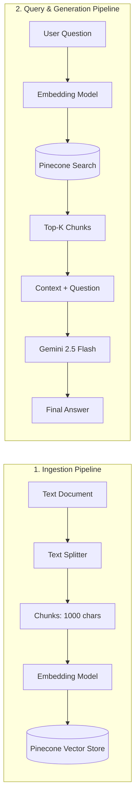

# 🦜🔗 LangChain & Agentic AI: Complete Master Learning Guide

> **Course:** Agentic AI Engineering with LangChain & LangGraph  
> **Instructor:** Eden Marco  
> **Author & Learner:** [@DineshRocky07](https://github.com/DineshRocky07)  
> **Repository:** [DineshRocky07/LangChain--Agentic-AI](https://github.com/DineshRocky07/LangChain--Agentic-AI.git)

---

## 📑 Table of Contents

1. [Overview & Core Mental Model](#-overview--core-mental-model)
2. [Project Setup & Tooling](#-project-setup--tooling)
3. [Environment Configuration & LangSmith Tracing](#-environment-configuration--langsmith-tracing)
4. [Evolution of AI Agents & Tools (Versions 1 - 4)](#-evolution-of-ai-agents--tools-versions-1---4)
5. [Under the Hood: The 3 Layers of Agents](#-under-the-hood-the-3-layers-of-agents)
   - [Layer 1: LangChain Tool Calling & Model Switching](#layer-1-langchain-tool-calling--model-switching)
   - [Layer 2: Raw Function Calling & The 7-Step Memory Loop](#layer-2-raw-function-calling--the-7-step-memory-loop)
   - [Layer 3: The Foundation of ReAct Prompting](#layer-3-the-foundation-of-react-prompting)
6. [RAG (Retrieval-Augmented Generation)](#-rag-retrieval-augmented-generation)
   - [Phase 1: Data Ingestion & Indexing](#phase-1-data-ingestion--indexing-rag_firstpy)
   - [Phase 2: Retrieval & Generation (Without LCEL vs With LCEL)](#phase-2-retrieval--generation-rag_second_without-lcelpy)
7. [🌿 Branch Directory & Project Index](#-branch-directory--project-index)

---

## 🧠 Overview & Core Mental Model

```text
###########################################################
#               THE AGENTIC TRIAD MENTAL MODEL            #
###########################################################

   👔 AGENT   = The Manager   (Decides what steps to take)
   🛠️ TOOL    = The Employee  (Performs specific jobs)
   🧠 GEMINI  = The Brain     (Reasons and generates logic)

###########################################################
```

### High-Level AI Hierarchy (Wiki)
- **LLM** ↓ The brain
- **Prompt** ↓ Instructions for the brain
- **Chain** ↓ Prompt + LLM connected together
- **Tool** ↓ Something the AI can use/do
- **Agent** ↓ AI decides which tools/actions to use
- **LangGraph** ↓ Controls a complex workflow/loop
- **Reflection** ↓ Generate → Review → Improve

---

## ⚙️ Project Setup & Tooling

We use modern Python packaging with **`uv`** (fastest Python package manager) and formatting tools:

```bash
# Step 1: Initialize uv project
uv init

# Step 2: Install primary dependencies
uv add langchain langchain-google-genai langchain-tavily tavily-python python-dotenv black isort
```

### Core Package Roles
| Package | Role & Purpose |
|---|---|
| `langchain` | Main LangChain framework for chains, prompts, agents, and tools |
| `langchain-google-genai` | Connects LangChain to Google Gemini models (`gemini-1.5-flash`, `gemini-2.5-flash`) |
| `langchain-tavily` | LangChain wrapper for Tavily real-time web search |
| `tavily-python` | Direct Tavily API client |
| `langchain-ollama` | Connects to local open-source models running on Ollama (`qwen3.5`, `gemma3`) |
| `langchain-pinecone` | Vector store client for Pinecone vector database |
| `langsmith` | Observability, debugging, and execution tracing |
| `python-dotenv` | Loads API keys and configurations from `.env` |
| `black` | Automatically formats Python code to PEP 8 standards |
| `isort` | Automatically sorts imports |

---

## 🔐 Environment Configuration & LangSmith Tracing

Create a `.env` file in the root directory:

```env
# Google Gemini API Key
GOOGLE_API_KEY="your_gemini_api_key"

# LangSmith Observability & Tracing
LANGSMITH_TRACING="true"
LANGSMITH_API_KEY="your_langsmith_key"
LANGSMITH_PROJECT="LangChain-Agentic-AI"

# Tavily Search API
TAVILY_API_KEY="your_tavily_key"

# Pinecone Vector DB
PINECONE_API_KEY="your_pinecone_key"
INDEX_NAME="your_pinecone_index_name"
```

### Basic Agent Initialization Template
```python
from dotenv import load_dotenv
from langchain.agents import create_agent
from langchain.tools import tool
from langchain_core.messages import HumanMessage
from langchain_google_genai import ChatGoogleGenerativeAI

load_dotenv()              # Load API keys
llm = ChatGoogleGenerativeAI(model="gemini-1.5-flash") # Gemini model (Brain)

@tool
def sample_tool(query: str) -> str:
    """Create functions agent can use."""
    return "result"

agent = create_agent(model=llm, tools=[sample_tool]) # Create AI agent (Manager)
response = agent.invoke({"messages": [HumanMessage(content="Hello!")]})
```

---

## 🚀 Evolution of AI Agents & Tools (Versions 1 - 4)

### Version 1: Static Custom Tools
- Agent defined with mock custom `@tool` functions returning predefined static strings.

### Version 2: Live Web Search with Tavily Client
- Integrated `from tavily import TavilyClient`.
- Automatically fetches `TAVILY_API_KEY` from environment.
- Transformed static functions into dynamic real-world search capabilities:
  ```python
  from tavily import TavilyClient
  tavily = TavilyClient()
  return tavily.search(query=query)
  ```

### Version 3: Built-in LangChain Tavily Tool
- Replaced manual client calls with native LangChain search tool:
  ```python
  from langchain_tavily import TavilySearch
  tools = [TavilySearch()]
  ```

### Version 4: Structured Output with Pydantic
- Enforcing typed, predictable schema for agent responses instead of plain raw strings:
  ```python
  from typing import List
  from pydantic import BaseModel, Field

  class Source(BaseModel):
      """Schema for source used by agent"""
      url: str = Field(description="The URL of the source")

  class AgentResponse(BaseModel):
      """Schema for agent response with answer and Source"""
      answer: str = Field(description="The agent's answer to the query")
      source: List[Source] = Field(default_factory=list, description="List of sources used to generate the answer")

  agent = create_agent(model=llm, tools=tools, response_format=AgentResponse)
  ```

> **Structured Output Strategies:**
> 1. `tool_strategy`: Enforces output using tool-calling schema.
> 2. `provider_strategy`: (Default) Uses model provider's native structured output capabilities.

---

## 🔍 Under the Hood: The 3 Layers of Agents

### Layer 1: LangChain Tool Calling & Model Switching
File: `1_agent_loop_langchain_tool_calling.py`

- Built an E-Commerce Assistant agent that handles queries about pricing and discount calculations.
- Seamlessly switched between local models (Ollama) and cloud APIs (Google Gemini) using `init_chat_model`:
  ```python
  from langchain.chat_models import init_chat_model

  Model_ollama = "qwen3.5:0.8b"
  Model_gemini = "gemini-1.5-flash"

  # Switch effortlessly:
  # llm = init_chat_model(f"ollama:{Model_ollama}", temperature=0)
  llm = init_chat_model(f"google_genai:{Model_gemini}", temperature=0)
  llm_with_tools = llm.bind_tools(tools)
  ```

---

### Layer 2: Raw Function Calling & The 7-Step Memory Loop
File: `2_agent_loop_raw_function_calling.py`

Demonstrates how tool calling works under the hood **without using LangChain**, breaking down how LLMs emit JSON and how code intercepts and executes them:

```text
 🧑 USER: "What is the price of a laptop?"
   │
   ▼
 📥 STEP 1: THE MEMORY BANK (messages list)
    We put the user's question into the 'messages' list.
    [ {"role": "user", "content": "What is the price of a laptop?"} ]
   │
   ▼
 🧠 STEP 2: THE AI BRAIN (ollama_chat_trace)
    We hand the memory bank to the AI. The AI thinks, but it CANNOT 
    look up the price itself. So, it asks you to do it.
    It generates a JSON package:
      {
         "name": "get_product_price",
         "arguments": {"product": "laptop"}
      }
   │
   ▼
 ⚙️ STEP 3: THE PYTHON INTERCEPTOR (Your Code)
    Your code catches the AI's JSON package and breaks it apart:
    • tool_name = "get_product_price"
    • tool_args = {"product": "laptop"}
   │
   ▼
 📖 STEP 4: THE DICTIONARY LOOKUP (tools_dict)
    Python needs to translate the text string into real code.
    It looks up "get_product_price" in your tools_dict and finds 
    the actual function sitting in memory.
    • tool_to_use = <function get_product_price>
   │
   ▼
 ⚡ STEP 5: THE EXECUTION (**)
    Python unpacks the bag of arguments directly into the function.
    CODE:  tool_to_use(**tool_args)
    MEANS: get_product_price(product="laptop")
   │
   ▼
 🎯 STEP 6: THE OBSERVATION (The Result)
    The function runs, checks the database, and spits out the answer.
    • observation = 50000
   │
   ▼
 📦 STEP 7: UPDATING THE MEMORY (messages.append)
    We write the result down on a piece of paper and shove it back 
    into the memory bank so the AI can read it.
    [ {"role": "tool", "name": "get_product_price", "content": "50000"} ]
   │
   └───► LOOP RESTARTS ↻ 
         We send the updated memory bank back to the AI (Step 2).
         The AI reads it, sees the price is 50000, and finally has 
         enough info to talk to the user!
```

---

### Layer 3: The Foundation of ReAct Prompting
File: `3_raw_ReAct_prompt.py`

Before native function calling APIs existed, agents operated purely via formatted text instructions following the **ReAct (Reason + Act)** pattern:

```text
Answer the following questions as best you can. You have access to the following tools:

{tools}

Use the following format:

Question: the input question you must answer
Thought: you should always think about what to do
Action: the action to take, should be one of [{tool_names}]
Action Input: the input to the action
Observation: the result of the action
... (this Thought/Action/Action Input/Observation can repeat N times)
Thought: I now know the final answer
Final Answer: the final answer to the original input question

Begin!

Question: {input}
Thought:{agent_scratchpad}
```

#### Why Native Function Calling Surpassed Raw ReAct:
- **Reliability:** No regex parsing failures or halluncinated formatting errors.
- **Cost Effective:** Lower token consumption.
- **Structured:** Guarantees strict JSON schema arguments.

---

## 📚 RAG (Retrieval-Augmented Generation)

RAG connects LLMs to custom knowledge bases (documents, PDFs, articles) by retrieving relevant excerpts before answering.



### Phase 1: Data Ingestion & Indexing (`Rag_first.py`)

1. **Document Loading**: `TextLoader` loads documents into memory.
2. **Text Chunking**: `CharacterTextSplitter(chunk_size=1000, chunk_overlap=100)` splits text into manageable pieces.
3. **Embeddings**: `GoogleGenerativeAIEmbeddings(model="gemini-embedding-2")` translates text into high-dimensional vector space.
4. **Vector Storage**: `PineconeVectorStore.from_documents(...)` persists chunks into Pinecone.

### Phase 2: Retrieval & Generation (`Rag_second_without LCEL.py`)

#### Approach A: Manual Retrieval (Without LCEL)
- Steps manually executed: `retriever.invoke(query)` ➔ string formatting ➔ `prompt_template.format_messages(...)` ➔ `llm.invoke(messages)`.
- *Drawbacks:* Verbose, synchronous, no built-in streaming or batching.

#### Approach B: Declarative Pipeline with LCEL (Recommended)
```python
def create_retrieval_chain_with_lcel():
    retrieval_chain = (
        RunnablePassthrough.assign(
            context=itemgetter("question") | retriever | formate_doc
        )
        | prompt_template
        | llm
        | StrOutputParser()
    )
    return retrieval_chain
```
- **Advantages:** Declarative pipe syntax (`|`), built-in streaming (`chain.stream()`), async execution (`chain.ainvoke()`), and LangSmith trace observability.

---

## 🌿 Branch Directory & Project Index

Each branch in this repository captures a dedicated milestone in the learning journey:

| Branch Name | Core Topic | Key Files | What You Can Learn |
|---|---|---|---|
| **`Rag`** *(Newest / Active)* | **Full RAG & Complete Agent Guide** | `Rag_first.py`<br>`Rag_second_without LCEL.py`<br>`1_agent_loop_langchain_tool_calling.py`<br>`2_agent_loop_raw_function_calling.py`<br>`3_raw_ReAct_prompt.py` | Complete RAG indexing into Pinecone, manual vs LCEL retrieval chains, plus full code for all 3 agent layers. |
| **`ReAct_Ecom_chatbot`** | **Under The Hood: 3 Agent Layers** | `1_agent_loop_langchain_tool_calling.py`<br>`2_agent_loop_raw_function_calling.py`<br>`3_raw_ReAct_prompt.py` | Deep dive into ReAct mechanics: LangChain tool calling, raw Python function execution loops, and classic ReAct prompt templates. |
| **`langchainSearchAgent`** | **Tavily Search & Structured Output** | `main.py`<br>`pyproject.toml` | Evolutionary progression from static tools to Tavily real-time search, finishing with Pydantic structured output (`Source`, `AgentResponse`). |
| **`agentLearn-23-jun`** | **First Agents & Tools** | `main.py`<br>`pyproject.toml` | Core Agentic Triad (Manager / Employee / Brain), `@tool` decorator, and introduction to live web search. |
| **`Langsmith_First_project`** | **Observability & Tracing** | `Langsmith.py`<br>`README.md` | Setting up LangSmith with `LANGSMITH_TRACING=true` and tracing chains with `@traceable`. |
| **`main`** | **Local LLMs with Ollama** | `Test_ollama.py`<br>`gen.py`<br>`main.py` | Connecting LangChain to local Ollama models (`gemma3:270m`, `qwen`), prompt templates, and chain execution. |
| **`day2-talkToLLM`** | **Talking to LLMs with Gemini** | `gen.py`<br>`main.py` | Early LangChain prompts, invoking Google Gemini, and parsing model text completions. |
| **`Lanchain/helloworld`** | **Project Setup & Hello World** | `main.py`<br>`pyproject.toml` | Environment bootstrap with `uv`, basic dependencies, and running your first LangChain script. |

---

## 📜 How to Switch Between Branches

To inspect the specific code for any topic:

```bash
# Fetch all remote branches
git fetch --all

# Checkout any branch (example: ReAct e-commerce chatbot)
git checkout ReAct_Ecom_chatbot

# Checkout the newest RAG branch
git checkout Rag
```

---

<div align="center">
  <sub>Documented with 💖 by <a href="https://github.com/DineshRocky07">Dinesh</a> during the Agentic AI Engineering Series.</sub>
</div>
